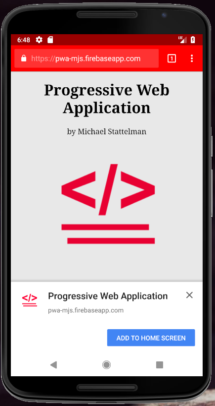

# pwa-template
This a base template for a Progressive Web Application.

This is just a skeleton structure for you to insert your code, css and js files and provide you with the prompt "add to homescreen" on mobile devices. 

******As long as your site is accessed over https******

#Directory Structure:

            |- index.html
            
            |- manifest.json
            
            |- service-worker.js
            
            |- styles/
            
            |- scripts/

              |- app.js

            |- img/    

                |- 1.jpg

                |- icons/
                  - * (all standard icons and favicons)
                
                
#Demo:(----Visit demo from a mobile device to see the prompt----)

https://pwa-mjs.firebaseapp.com/

